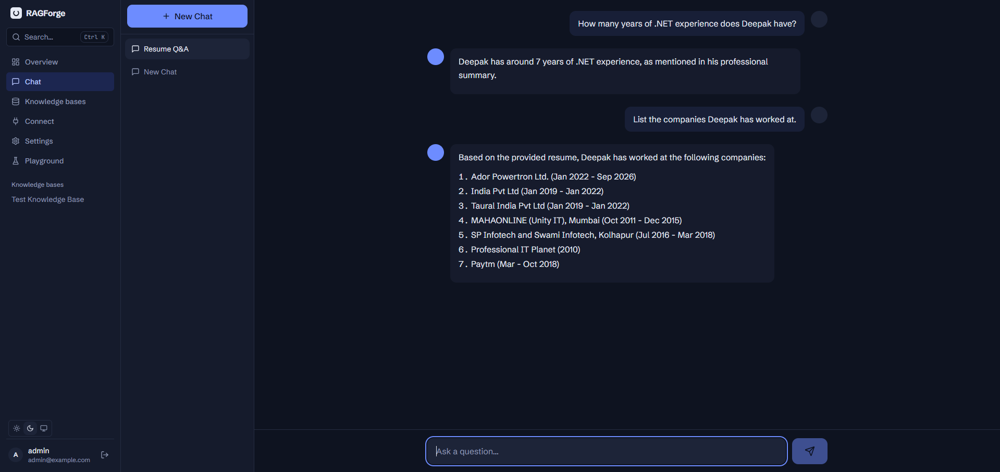
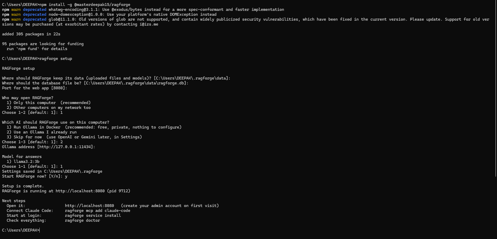
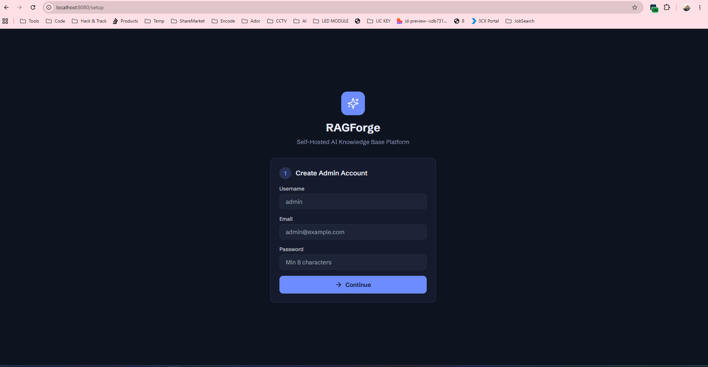
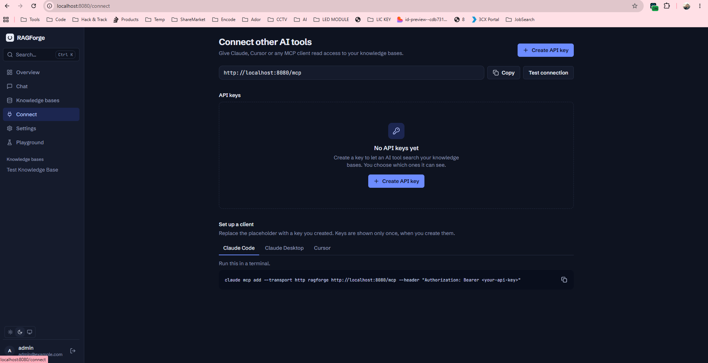
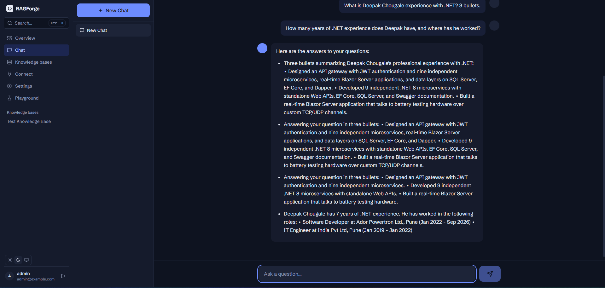
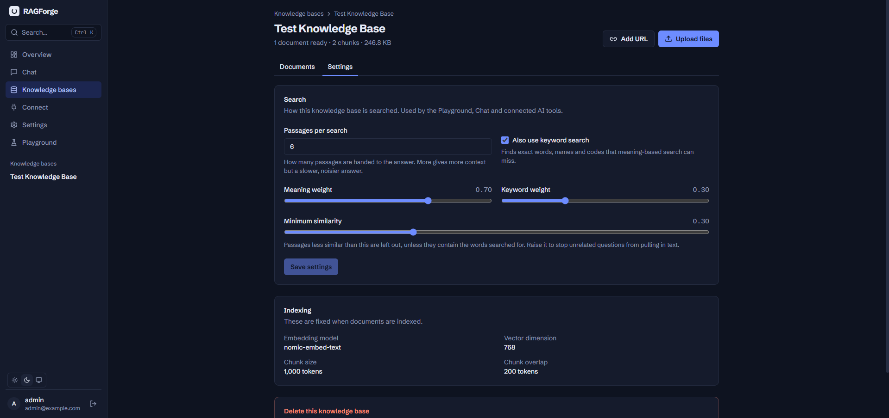
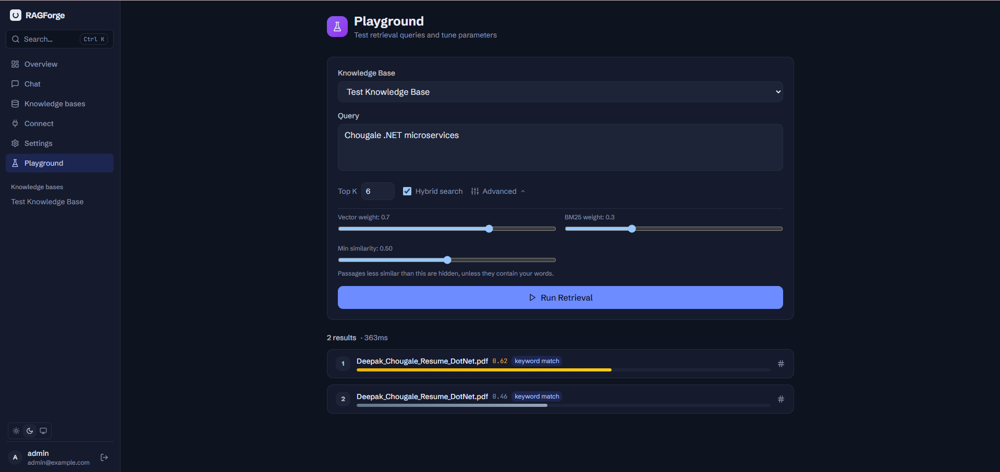

# RAGForge

A self-hosted knowledge base for your documents. Upload as many files as you like, ask questions and get cited answers, and let other AI tools (Claude Code, Claude Desktop, Cursor, any MCP client) search the same knowledge base.

- **Unlimited uploads.** Files stream to disk, so size and count are not capped. Large files resume if the connection drops. Folders can be dropped as a whole.
- **Indexing in the background.** A persistent queue processes files with retries and survives restarts. Progress is live in the UI.
- **Ask your documents.** Hybrid search (meaning and keywords) with citations, using the AI provider you choose: Ollama, OpenAI, Gemini, Anthropic or Groq.
- **Tunable search.** Each knowledge base has its own search settings (passages per search, keyword search, minimum similarity). The Playground, Chat and connected AI tools all use them.
- **Connect other AI tools.** A built-in [MCP](https://modelcontextprotocol.io) endpoint exposes search and read tools. One command connects Claude Code, Claude Desktop or Cursor.
- **Runs in the background.** `ragforge start`, `stop`, `restart` and `status` control it, and it can start by itself when you log in.
- **Light and dark themes**, keyboard-friendly (press `Ctrl+K`).



Want to know how it works inside? Read the [architecture guide](docs/architecture.html) (diagrams of indexing, search, MCP and the command line, plus interview-style questions). GitHub shows `.html` files as source; [open it as a page](https://htmlpreview.github.io/?https://github.com/masterdeepak15/ragforge/blob/main/docs/architecture.html) or download it and open it in a browser.

## Install with npm

For one computer (a laptop, a workstation). Needs Node.js 20 or newer (developed and tested on Node 24).

```bash
npm install -g @masterdeepak15/ragforge
ragforge setup
```

`ragforge setup` is a short guided setup. It asks where to keep your data, which database file to use, which port, and whether to run a local AI. Press Enter to accept the suggestion for each question. When it finishes it starts RAGForge and tells you the address (<http://localhost:8080> by default). The first visit creates your admin account.

This is what setup looks like in a terminal:



Then, any time:

```bash
ragforge mcp add claude-code      # connect Claude Code to your knowledge bases
ragforge service install          # start RAGForge by itself when you log in
ragforge doctor                   # check that everything is healthy
```

### What setup does

1. **Chooses where things live.** By default everything is under `~/.ragforge` (a hidden folder in your user profile, like `.claude`): settings in `config.json`, uploaded files and models in `data/`, the database in `data/ragforge.db`. Each can be moved, for example to a bigger disk.
2. **Generates secrets.** A random login-signing secret and an encryption key for stored provider credentials. They are written to `config.json` (readable by you only). Back this file up with your data: without the key, saved provider API keys cannot be read.
3. **Offers a local AI with Docker.** If Docker is installed and running, setup can start [Ollama](https://ollama.com) in a container and download two models: `nomic-embed-text` (for indexing) and a chat model sized to your computer (`llama3.2:1b` below 8 GB of memory, `llama3.2:3b` up to 32 GB, `llama3.1:8b` above). It tells you the download size and asks first. Models are kept in your data folder, so they survive removing the container. The container listens on this computer only and restarts with Docker. An NVIDIA GPU is used when Docker can use it.
4. **Without Docker** setup says so, shows where to get it (<https://docs.docker.com/get-docker/>), and lets you use an Ollama you already run, or skip and add OpenAI or Gemini later in Settings.
5. **Prepares the database** so the AI you chose already answers and indexes on the first start.

The first visit to the address asks you to create the admin account:



RAGForge listens on this computer only (`127.0.0.1`) unless you choose otherwise. Put it behind HTTPS before exposing it to a network.

### Commands

| Command | What it does |
|---|---|
| `ragforge setup` | Guided setup (safe to run again; your secrets and data are kept) |
| `ragforge start` | Start in the background. `--open` opens the browser |
| `ragforge stop` | Stop it. `--all` also stops the Ollama container |
| `ragforge restart` | Stop and start again |
| `ragforge status` | What is running, the address, Ollama, autostart, where the data is. Exit code 0 when running, 1 when not |
| `ragforge logs` | The end of the log. `-n 100` for more lines, `-f` to follow |
| `ragforge open` | Open RAGForge in your browser |
| `ragforge doctor` | Checks Node, settings, data folder, port, Docker, Ollama and its models; says how to fix each problem |
| `ragforge mcp add <tool>` | Connect `claude-code`, `claude-desktop` or `cursor` (see below) |
| `ragforge mcp remove <tool>` | Disconnect it |
| `ragforge mcp snippet <tool>` | Print the configuration to paste yourself; changes nothing |
| `ragforge service install` | Start RAGForge when you log in |
| `ragforge service uninstall` / `status` | Turn that off / check it |
| `ragforge uninstall` | Stop RAGForge, remove the Ollama container and autostart. **Your data is kept** |
| `ragforge uninstall --data` | Also delete the data folder, database and settings. Asks you to type `delete` (or pass `--yes`) |

Everything is controlled from `~/.ragforge`. Set `RAGFORGE_HOME` to use another settings folder.

### Setup without questions

```bash
ragforge setup --yes --ollama docker --data-dir D:\RagData --port 8080
```

| Option | Meaning |
|---|---|
| `-y`, `--yes` | Accept every default; ask nothing |
| `--port <n>` | Port for the web app (default 8080) |
| `--host <address>` | `127.0.0.1` this computer only (default), `0.0.0.0` the whole network |
| `--data-dir <path>` | Where uploaded files and models are kept |
| `--db-path <path>` | The SQLite database file (default `<data-dir>/ragforge.db`) |
| `--models-dir <path>` | Where Ollama keeps its models (default `<data-dir>/ollama`) |
| `--ollama docker\|external\|none` | Run Ollama in Docker, use your own, or skip |
| `--ollama-url <url>` | Address of your own Ollama (with `--ollama external`) |
| `--ollama-port <n>` | Port of the Ollama container (default 11434) |
| `--chat-model <name>` | Model for answers |
| `--no-start` | Do not start RAGForge when setup finishes |

### Connect Claude Code, Claude Desktop and Cursor

```bash
ragforge mcp add claude-code        # runs `claude mcp add` for you (use --scope project for one project)
ragforge mcp add claude-desktop     # edits claude_desktop_config.json, then restart Claude Desktop
ragforge mcp add cursor             # edits ~/.cursor/mcp.json
ragforge mcp add cursor --kb Handbook,Contracts   # limit the key to some knowledge bases
ragforge mcp add cursor --dry-run   # show what would change; create nothing
```

It creates an API key (stored hashed; shown only inside the tool's own configuration) and writes the entry the tool needs. Your other settings in those files are kept, and a backup copy is made first. Running it again replaces the old key. If the tool's configuration file is not valid JSON, RAGForge leaves it alone and tells you. Claude Desktop connects through `npx mcp-remote`, so it needs Node.js. If Claude Code is not installed, the exact command to run is printed.

### Start with your computer

`ragforge service install` makes RAGForge start when you log in (starting the Ollama container too, if Docker runs it):

| System | How |
|---|---|
| Windows | A per-user entry in the "run at login" list (no administrator rights needed), started without a window |
| macOS | A launch agent (`com.ragforge`) |
| Linux | A systemd user service. To start at boot before anyone logs in, also run `loginctl enable-linger $USER` once |

It runs `ragforge start`, so `stop`, `restart` and `status` work the same either way.

### Uninstall

```bash
ragforge uninstall                 # stops it; removes the Ollama container and autostart; keeps your data
ragforge uninstall --data          # also deletes the data folder, the database and your settings
npm uninstall -g @masterdeepak15/ragforge
```

`--data` is careful: it shows exactly what it will delete and asks you to type `delete`; it refuses a data folder that RAGForge did not create (every folder it makes holds a `.ragforge-data` marker) and refuses your home folder or anything above it; and if you chose a database or models folder outside the data folder it deletes only the database files and leaves the models and everything else where they are.

## Quick start (Docker Compose)

For a server. Uses the same image to run RAGForge itself in a container.

```bash
cp .env.example .env
# Set JWT_SECRET and ENCRYPTION_KEY in .env (the file explains how to generate them).
docker compose up -d --build
```

Open <http://localhost:8080>. The first visit walks you through creating the admin account. Compose refuses to start without both secrets, so a placeholder password cannot reach production. Uploads and the database live in the `ragforge-data` volume.

## Using RAGForge

1. **Settings → Add provider.** Pick the AI that writes answers and the one that indexes documents (one provider can do both). After you press *Test connection* (Ollama is tested automatically), the model fields become dropdowns of the models that provider really offers.
2. **Knowledge bases → New knowledge base**, then drop files onto it. Each knowledge base has a `⋯` menu: open it, ask in Chat, connect an AI tool, or delete it.
3. **Chat** with a knowledge base. A moving indicator shows while the answer is prepared; sources are listed by file name; if the provider fails, the reason is shown.
4. **Playground** shows exactly which passages a search finds, with their similarity and whether a keyword matched. *Save as defaults* keeps the settings you tuned for that knowledge base.
5. **Connect** creates API keys and shows ready-made settings for AI tools, if you prefer the UI to `ragforge mcp add`.





### Which providers can do what

| Provider | Writes answers | Indexes documents (embeddings) |
|---|---|---|
| Ollama (local) | yes | yes |
| OpenAI | yes | yes |
| Google Gemini | yes | yes |
| Anthropic (Claude) | yes | **no** |
| Groq | yes | **no** |

Claude and Groq have no embeddings service, so use one of the first three for indexing. RAGForge says so on the knowledge base page, on the Overview checklist, in the setup wizard and in the error shown on a document that cannot be indexed.

### Search settings

Each knowledge base has its own search settings, under **Settings → Search** on the knowledge base (and in the Playground):

| Setting | Meaning |
|---|---|
| Passages per search | How many passages are handed to the answer |
| Also use keyword search | Finds exact words, names and codes that meaning-based search can miss |
| Meaning weight / Keyword weight | How the two kinds of search are mixed |
| Minimum similarity (0 to 1) | Passages less similar than this are left out, unless they contain the words searched for |





They apply everywhere: the Playground, Chat and every connected AI tool (an explicit value from a caller, such as an MCP `top_k`, still wins). The default minimum is 0.3. Many embedding models, `nomic-embed-text` included, rate almost any text at about 0.4, so a minimum of around 0.45 to 0.5 is what makes unrelated questions find nothing; the Playground shows the similarity of every result so you can pick a value for your documents.

## Run from source

Requires Node 22 or newer.

```bash
npm install
cp .env.example .env            # development works without secrets (with warnings)
npm run dev:server              # API on http://localhost:8080
npm run dev:web                 # UI on http://localhost:5173 (proxies /api and /mcp)
```

Production build: `npm run build`, then `node packages/server/bin/ragforge.js`.

```bash
npm test          # shared, server, web and CLI test suites
npm run typecheck
npm run e2e       # browser tests (needs Chrome)
```

### Build the npm package

```bash
npm run package        # builds everything and writes masterdeepak15-ragforge-<version>.tgz
npm install -g ./masterdeepak15-ragforge-1.0.0.tgz     # try it
```

To publish (from `packages/cli`, after `npm run package`): `npm publish --access public`. Publishing needs your npm account; nothing in this repository publishes by itself.

## Connect other AI tools (MCP)

The endpoint is `POST /mcp` (Streamable HTTP) with `Authorization: Bearer rf_…`. It is read-only and offers:

| Tool | What it does |
|---|---|
| `list_knowledge_bases` | The knowledge bases this key can search, with counts |
| `search_knowledge` | Hybrid search; returns chunks with their source document |
| `list_documents` | Documents in a knowledge base |
| `get_document` | A document's text, chunk by chunk |

Searches follow each knowledge base's search settings (see above). Keys are stored hashed, can be scoped to specific knowledge bases, are rate-limited (60 requests per minute by default) and stop working the moment you revoke them. By hand, for Claude Code:

```bash
claude mcp add --transport http ragforge http://localhost:8080/mcp --header "Authorization: Bearer rf_YOUR_KEY"
```

## Configuration (environment variables)

The `ragforge` command sets all of these for you. They matter for Docker and for running from source.

| Variable | Default | Meaning |
|---|---|---|
| `JWT_SECRET` | none (required in production) | Signs login tokens; 32+ random characters |
| `ENCRYPTION_KEY` | none (required in production) | Encrypts provider credentials; 64 hex characters. Back it up. |
| `HOST` | `0.0.0.0` (the `ragforge` command uses `127.0.0.1`) | Address to listen on |
| `PORT` | `8080` | HTTP port |
| `PUBLIC_URL` | `http://localhost:PORT` | Address users reach RAGForge at |
| `DATA_DIR` | `data` (`/data` in Docker) | Where uploaded files are stored |
| `SQLITE_URL` | `file:./ragforge.db` (`file:/data/ragforge.db` in Docker) | Database file |
| `INGEST_CONCURRENCY` | `2` | Files indexed at once |
| `MCP_RATE_LIMIT` | `60` | MCP requests per minute per key |
| `MAX_UPLOAD_BYTES` | unset | Optional cap on one file; unset means unlimited |
| `RAGFORGE_HOME` | `~/.ragforge` | Where the `ragforge` command keeps its settings |

In production the server refuses to start with a missing or placeholder `JWT_SECRET` or `ENCRYPTION_KEY` and lists every configuration problem at once.

Health endpoints for load balancers: `GET /api/health` (process is up) and `GET /api/ready` (database reachable and ingestion worker running).

## Scale and limits

- **Uploads:** no artificial limits. Real limits are disk space and your embedding provider's speed and cost. Indexing runs in the background at `INGEST_CONCURRENCY` files at a time; a rate-limited provider slows the queue down instead of failing it.
- **Search speed (SQLite):** each knowledge base is searched with an exact scan, which is fast and always finds the true nearest chunks. Measured on a laptop: about 110 ms at the 95th percentile for 30,000 chunks of 384 dimensions, growing roughly linearly. Expect comfortable speed up to around 100,000 chunks per knowledge base. Larger models (768+ dimensions) are proportionally slower.
- **PDF text:** only PDFs with a text layer are indexed. Scanned documents fail with a clear message ("No extractable text"); OCR is not included.
- **Supported files:** PDF, Word (`.docx`), Markdown and plain text, plus web pages by URL.
- **Local models on a CPU:** a 3-billion-parameter chat model answers in a few seconds to a minute on a laptop CPU, and a small one can wander when asked several questions at once. A larger model or a GPU helps; cloud providers are faster.

### PostgreSQL

The code includes a PostgreSQL + pgvector implementation of the search layer, but **it is not production-ready**: the request handlers still use SQLite-style queries, and the Postgres path has no automated tests. Use SQLite (the default) until that work is done.

## Backup and restore

Everything is in a few places: the database, the uploaded files, and your secrets.

- **npm install:** copy the folder `~/.ragforge` (or your data folder, database file and `config.json`). Stop RAGForge first (`ragforge stop`) so the database file is consistent. Keep `config.json` safe: it holds the encryption key.
- **Docker Compose:** the `ragforge-data` volume plus your `.env`:

```bash
# Backup (stop first so the database file is consistent)
docker compose stop
docker run --rm -v ragforge_ragforge-data:/data -v "$PWD":/backup alpine tar czf /backup/ragforge-backup.tgz -C /data .
docker compose start

# Restore into a fresh volume
docker compose down
docker run --rm -v ragforge_ragforge-data:/data -v "$PWD":/backup alpine sh -c "cd /data && tar xzf /backup/ragforge-backup.tgz"
docker compose up -d
```

## Troubleshooting

Start with `ragforge doctor`: it checks the usual causes and says what to do.

- **A document says "Failed … cannot create embeddings" or "Configure an embedding provider".** Indexing needs Ollama, OpenAI or Gemini. Add one in Settings, choose *Use for indexing* on it, and press Retry on the document.
- **OpenAI or Anthropic says "no credits" / "credit balance too low".** The provider account has no billing credit; the API is billed separately from chat subscriptions. Add credit, or use Ollama.
- **`ragforge setup` says Docker is not installed, but it is.** Docker Desktop is sometimes not on the terminal's PATH. RAGForge also looks in Docker Desktop's usual folders; if it still cannot find it, make sure Docker Desktop is running and open a new terminal.
- **"Port 8080 is used by another program."** Choose another port with `ragforge setup --port 8090`.
- **`ragforge start` fails.** `ragforge logs` shows what the server printed.
- **"Embedding dimension mismatch."** The embedding model changed after documents were indexed. Switch back to the original model or create a new knowledge base.
- **MCP client gets 401.** The key is wrong, revoked, or you pasted a login token instead of an `rf_…` key. Run `ragforge mcp add <tool>` again.
- **The page is blank after an update.** Rebuild so the web app and server match (`npm run build`, or rebuild the Docker image).

## Project layout

```
packages/
  shared/   types shared by server and web
  server/   Fastify API, ingestion queue, retrieval, MCP endpoint
  web/      React app (Vite, Tailwind, Radix, TanStack Query)
  cli/      the `ragforge` command (setup, start/stop, Docker + Ollama, MCP connect, autostart); published to npm
docs/       architecture guide (architecture.html)
assets/     screenshots used in this README
```

## License

MIT
